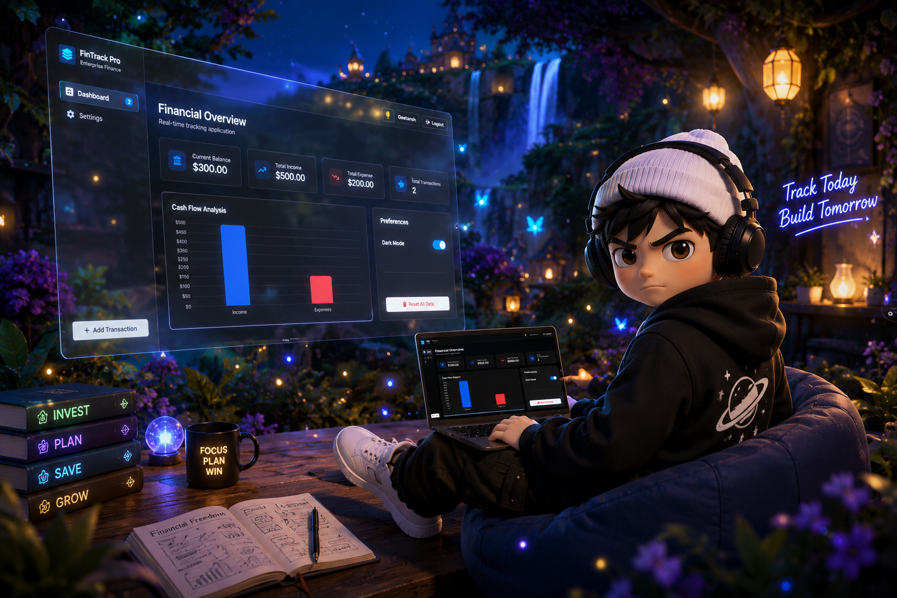

# 📊 FinTrack Pro — Interactive Personal Finance Tracker
 
A premium, visually interactive personal finance tracker dashboard built using **Vanilla HTML, CSS, and JavaScript**. 
Created as part of **Sheryians Coding School, Cohort 3.0** assignment.
 
---
 
## 🌐 Live Demo
 
[View Live Project →](https://fin-track-pro-liard.vercel.app/)
 
---
 
## 📸 Preview
 
 *(Take a screenshot of the app and save it in assets/preview.png to show it here)*
 
---
 
## 🚀 What I Built
 
The assignment was to build a comprehensive finance tracking client. 
 
I engineered a premium personal dashboard called **FinTrack Pro**. It features a **dual-design aesthetic**—blending Figma Pastel blocks in Light Mode with Vercel Minimalist dark mode elements in Dark Mode. All operations—authentication, transaction CRUD, searching, filtering, charts, currency formatting, settings update, and CSV exports—are handled dynamically on the client-side with native JavaScript and persist directly in browser storage.
 
---
 
## ✨ Features
 
- **User Authentication (Client-side)** — Login & registration system with state persistence in `localStorage`, password visibility toggles, and instant UI state switches.
- **Real-Time Financial Metrics** — Dynamic counters that instantly calculate Current Balance, Total Income, Total Expenses, and Transaction Count on changes.
- **Dynamic Cash Flow Analysis** — Interactive Chart.js bar chart that displays monthly cash flows and dynamically adapts its colors, labels, and ticks when toggling between dark and light themes.
- **Full Transaction CRUD Operations**:
  - **Create**: Modal overlay to quickly add new transactions with description, amount, date, type (Income/Expense), and category emojis.
  - **Read**: A structured records table with automated human-friendly date formatting (e.g., *Oct 12, 2026*).
  - **Update**: An in-place Edit Transaction modal that dynamically pre-fills existing transaction fields for updating.
  - **Delete**: Quick delete button with confirmation prompts.
- **Live Search & Filters** — Instant search that queries description, category, or amount, alongside a quick filter dropdown for transaction types (Income vs. Expense).
- **Export to CSV** — Generates and downloads a clean, formatted CSV of the active user's transaction history directly from the browser.
- **Synchronized Theme Engine** — Synchronized dark mode toggles (on top bars and inside Dashboard preferences) that switch CSS custom properties, apply a radial glowing background, and update chart styling.
- **Settings & Profile Controls** — Profile dashboard to update full names, switch primary currencies (USD, EUR, GBP, INR, JPY) which automatically update symbol formatting across all stats, and a Danger Zone wipe trigger to clear all application data.
- **Fully Responsive Layout** — Tailored grid and flexbox rules to transition smoothly between Desktop, Tablet, and Mobile displays.
- **XSS Protection** — Input sanitization when rendering lists dynamically to prevent HTML injection.

---
 
## ⚠️ Real Challenges I Faced & Solved
 
**1. JavaScript State Synchronization**
Managing authentication state, transaction lists, currency symbols, and settings simultaneously without using frontend frameworks (like React or Vue) was complex. I resolved this by utilizing a single global `state` object and a unified `renderDashboard()` pipeline that updates all UI blocks whenever state changes.
 
**2. Chart.js Re-rendering Collision**
Re-rendering charts on transaction updates or theme toggles originally threw a `"Canvas is already in use"` exception. I solved this by tracking the active chart instance globally (`cashFlowChartInstance`) and programmatically invoking `.destroy()` on the existing instance before instantiating a new one.
 
**3. Dynamic Currency & Number Formatting**
Formatting numbers according to different currency locales dynamically was tricky. I solved this by implementing a map of ISO currency codes (USD, EUR, GBP, INR, JPY) to symbols and running `toLocaleString` formatting on calculations to output clean outputs (e.g., `₹1,24,500.00` or `$1,245.00`).
 
**4. Hybrid Dark Mode Design System**
Blending Figma's colorful pastel theme (light canvas background, bold card borders, flat shadows) with Vercel's stark dark design (ink background, neon accents, radial background gradients) required mapping every color, border, and border-radius to CSS custom variables (`:root` and `body.dark-mode`).

---
 
## 📚 What I Learned
 
- Implementing state persistence via `localStorage` and wrapping JSON parse statements in try-catch blocks to prevent application crashes.
- Cleaning up and destroying canvas-based chart instances to prevent resource leaks.
- How to perform direct DOM manipulation securely by escaping HTML inputs to block cross-site scripting (XSS) attacks.
- Designing responsive components (like sidebars and data tables) that stack or slide cleanly on mobile viewports.
 
---
 
## 🛠 Tech Used
 
`HTML5` &nbsp; `CSS3` &nbsp; `JavaScript (ES6+)` &nbsp; `Chart.js` &nbsp; `FontAwesome Icons` &nbsp; `Responsive Design` &nbsp; `CSS Variables` &nbsp; `LocalStorage API`
 
---
 
## 📂 How to Run
 
No installations, package managers, or local dev servers are required.  
Download/clone this folder → Open `index.html` in any modern web browser. Done!
 
---
 
## 🌐 Connect With Me
 
[GitHub](https://github.com/geetansh-sirohi) · [Instagram](https://www.instagram.com/code.with.geetansh) · [LinkedIn](https://www.linkedin.com/in/geetansh-sirohi)
 
---

*Built during Sheryians Coding School · Cohort 3.0 · Frontend Assignment · Class 10th*
